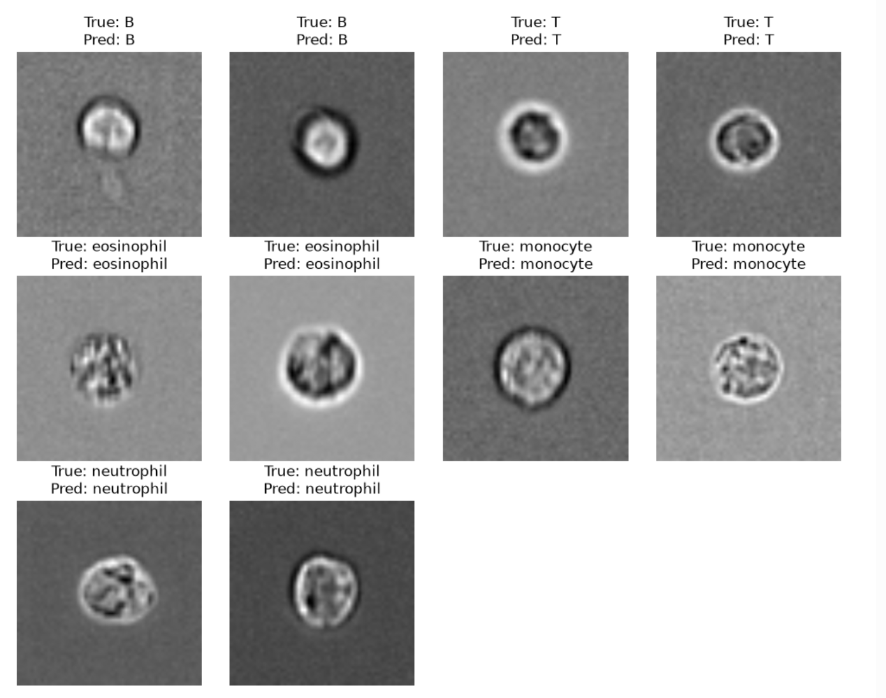

# White Blood Cell Classification from Microscopy Images

A deep learning project for classifying white blood cells from microscopy images using the **BBBC045** dataset.

The goal of this project is to gain hands-on experience with microscopy image preprocessing, dataset construction, deep learning, transfer learning, and model evaluation.

## Overview

This project classifies white blood cells into five classes:

- B cell
- T cell
- Eosinophil
- Monocyte
- Neutrophil

Two models were implemented and compared:

1. Custom Simple CNN
2. Pretrained EfficientNet-B0

---

## Dataset

This project uses **BBBC045 - Human White Blood Cells**.

The original microscopy images are montage images with a resolution of:

```text
1650 × 1650
```

Individual cells were extracted as:

```text
55 × 55
```

TIFF image patches.

The current classification experiments use the `ch5` microscopy channel.

### Dataset Split

To reduce data leakage between images from the same subject, the dataset was split at the **subject level** rather than randomly splitting individual cell images.

| Split | Number of cells |
|---|---:|
| Train | 60,649 |
| Validation | 17,303 |
| Test | 22,153 |

The Test set is kept separate from model development.

---

## Preprocessing

The preprocessing pipeline includes:

- Reading microscopy TIFF images
- Extracting individual `55 × 55` cell images from montage images
- Detecting and excluding unused zero-padded regions
- Saving processed cell images
- Creating metadata for each cell
- Subject-level Train / Validation / Test split
- Normalization using statistics calculated from the Train set only

Normalization:

```text
normalized pixel =
(pixel - training mean) / training standard deviation
```

For EfficientNet-B0, the input is converted as follows:

```text
55 × 55 grayscale image
        ↓
Normalization
        ↓
Resize to 224 × 224
        ↓
Repeat grayscale channel 3 times
        ↓
3 × 224 × 224
        ↓
EfficientNet-B0
```

---

## Class Imbalance

The dataset is highly imbalanced, particularly because neutrophils are much more common than some of the other classes.

To reduce majority-class bias, a class-weighted CrossEntropyLoss was used.

The weight for each class is calculated as:

```text
weight =
total training samples
--------------------------------
number of classes × class samples
```

---

## Models

### Simple CNN

A small convolutional neural network was implemented as a baseline.

The architecture includes:

- Convolution layers
- ReLU activation
- Max pooling
- Fully connected classification layer

### EfficientNet-B0

A pretrained **EfficientNet-B0** model from `torchvision` was used for transfer learning.

The original ImageNet classification layer was replaced with a new output layer for the five white blood cell classes.

---

## Results

Validation performance:

| Model | Validation Accuracy | Macro F1 |
|---|---:|---:|
| Simple CNN | 95.31% | 89.15% |
| EfficientNet-B0 | **96.42%** | **93.25%** |

EfficientNet-B0 improved both Validation Accuracy and Macro F1 compared with the Simple CNN baseline.

### EfficientNet-B0 Metrics

```text
Validation Accuracy : 0.9642
Macro Precision     : 0.9132
Macro Recall        : 0.9556
Macro F1            : 0.9325
```

### Class-wise Performance

| Class | Precision | Recall | F1 |
|---|---:|---:|---:|
| B | 0.75 | 0.90 | 0.82 |
| T | 0.99 | 0.94 | 0.96 |
| Eosinophil | 0.95 | 0.99 | 0.97 |
| Monocyte | 0.89 | 0.96 | 0.92 |
| Neutrophil | 1.00 | 0.99 | 1.00 |

The largest remaining confusion occurs between B cells and T cells.

---

## Example Predictions

Examples of white blood cell images from the validation set and the corresponding EfficientNet-B0 predictions.



---

## Project Structure

```text
microscopy-wbc-classification/
│
├── 01_data_exploration.ipynb
├── 02_build_dataset.ipynb
├── 03_split_dataset.ipynb
├── 04_model_training.ipynb
├── 05_efficientnet_training.ipynb
│
├── results/
│   └── efficientnet_predictions.png
│
├── README.md
└── requirements.txt
```

---

## Notebook Workflow

### `01_data_exploration.ipynb`

- Explore BBBC045 microscopy images
- Inspect image dimensions
- Inspect montage structure
- Test individual cell cropping

### `02_build_dataset.ipynb`

- Extract individual `55 × 55` cell images
- Detect valid cell regions
- Save processed TIFF images
- Generate metadata

### `03_split_dataset.ipynb`

- Create Train / Validation / Test datasets
- Perform subject-level splitting
- Prevent subject leakage between datasets

### `04_model_training.ipynb`

- Implement the Simple CNN baseline
- Apply normalization
- Apply class-weighted loss
- Train and validate the model
- Evaluate classification performance

### `05_efficientnet_training.ipynb`

- Prepare microscopy images for EfficientNet-B0
- Resize images to `224 × 224`
- Convert grayscale images to 3-channel input
- Load pretrained EfficientNet-B0
- Replace the classification layer
- Fine-tune the model
- Save the best model checkpoint
- Evaluate Validation Accuracy, Macro F1, and class-wise performance

---

## Environment

Main tools and libraries:

```text
Python 3.12
PyTorch
torchvision
NumPy
pandas
tifffile
scikit-learn
matplotlib
tqdm
```

Training was performed using CUDA on an NVIDIA GPU.

---

## Future Work

Possible extensions include:

- Comparing different microscopy channels
- Multi-channel microscopy classification
- Grad-CAM visualization
- Final evaluation on the held-out Test set
- Publishing the trained EfficientNet-B0 model on Hugging Face

---

## Dataset

BBBC045 is provided by the **Broad Bioimage Benchmark Collection (BBBC)**.

The original dataset is not redistributed in this repository.
